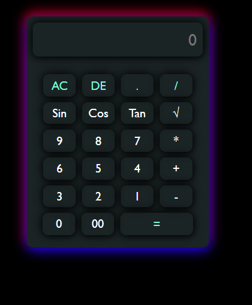

# 🖩 Simple Calculator

A basic **Calculator** built using **HTML, CSS, and JavaScript**. This project performs arithmetic operations like **Addition, Subtraction, Multiplication, and Division**.

## 📌 Features
✅ Perform basic arithmetic operations  
✅ Responsive and User-friendly UI  
✅ Built with **HTML, CSS, and JavaScript**  
✅ Live display of calculations  

## 🚀 Live Demo
🔗 [View Project](https://github.com/Rizwan-Khan-2002/Calculator-project.git) (If hosted on GitHub Pages or any other platform)

## 📸 Screenshot
 *(Upload a screenshot and update the file name if needed)*  

## 🛠️ Installation & Usage
1. **Clone the repository**  
   ```sh
   git clone https://github.com/Rizwan-Khan-2002/Calculator-project.git
